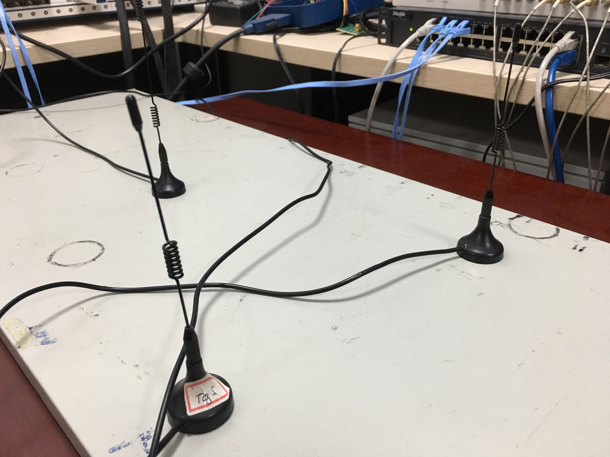

Summary of Bingnan Chen's works
====
## Research experience
### 1.User Activity recognition and Identification through Wireless Backscattering (Advisor:Panlong Yang)
First, I have to collect signal data with the help of senior students through 
wireless devices and software `Labview`. <br>
<br>
<br>
Second, I need to change the format of the data through a bash file. <br>
<br>
<br>
<br>
Third, I use `Matlab` to do some signal preprocessing. <br>
<br>
Finally, I use neural network to do some classifications and identifications. Here are photos from some demos about the program. <br>
Reference from paper:*Back-Guard : Parallel Attention Model based User Activity Recognition and Identification through Wireless Backscattering*<br>
<br>
<br>
### 2.Summer exchange in Shanghai JiaoTong University(SJTU)
*https://github.com/ChampionNan/AI-interaction-in-sjtu/blob/master/Lab%20report.pdf* (Detailed lab report)
<br>
## projects
### 1.C minus compiler(Supervisor:Prof.Cheng Li)
#### (1)Lexical analyzer
Here is an example: `gcd.cminus` <br>
```
int gcd (int u, int v) { /* calculate the gcd of u and v */
    if (v == 0) return u;
    else return gcd(v, u - u / v * v); /* v,u-u/v*v is equals to u mod v*/
}
int main(void) {
    int x; int y; int temp;
    x = 72;
    y = 18;
    if (x<y) {
        temp = x;
        x = y;
        y = temp;
    }
    gcd(x,y);
    return 0;
}

```
After the lexial analyzer process, the output tokens file is:(format:<type,line,start_position,end_position>)<br>
```
int 280 1   1   4
gcd 284 1   5   8
(   272 1   9   10
int 280 1   10  13
u   284 1   14  15
,   271 1   15  16
int 280 1   17  20
v   284 1   21  22
)   273 1   22  23
{   276 1   24  25
if  279 2   5   7
(   272 2   8   9
v   284 2   9   10
==  267 2   11  13
0   285 2   14  15
)   273 2   15  16
return  281 2   17  23
u   284 2   24  25
;   270 2   25  26
else    278 3   5   9
return  281 3   10  16
gcd 284 3   17  20
(   272 3   20  21
v   284 3   21  22
,   271 3   22  23
u   284 3   24  25
-   260 3   26  27
u   284 3   28  29
/   262 3   30  31
v   284 3   32  33
*   261 3   34  35
v   284 3   36  37
)   273 3   37  38
;   270 3   38  39
}   277 4   1   2
int 280 5   1   4
main    284 5   5   9
(   272 5   9   10
)   273 5   10  11
{   276 5   12  13
int 280 6   5   8
x   284 6   9   10
;   270 6   10  11
int 280 6   12  15
y   284 6   16  17
;   270 6   17  18
int 280 6   19  22
temp    284 6   23  27
;   270 6   27  28
x   284 7   5   6
=   269 7   7   8
72  285 7   9   11
;   270 7   11  12
y   284 8   5   6
=   269 8   7   8
18  285 8   9   11
;   270 8   11  12
if  279 9   5   7
(   272 9   8   9
x   284 9   9   10
<   263 9   10  11
y   284 9   11  12
)   273 9   12  13
{   276 9   14  15
temp    284 10  9   13
=   269 10  14  15
x   284 10  16  17
;   270 10  17  18
x   284 11  9   10
=   269 11  11  12
y   284 11  13  14
;   270 11  14  15
y   284 12  9   10
=   269 12  11  12
temp    284 12  13  17
;   270 12  17  18
}   277 13  5   6
gcd 284 14  5   8
(   272 14  8   9
x   284 14  9   10
,   271 14  10  11
y   284 14  11  12
)   273 14  12  13
;   270 14  13  14
return  281 15  5   11
0   285 15  12  13
;   270 15  13  14
}   277 16  1   2
```
<br>
<br>
#### (2)syntax analyzer
After the syntax analyzer process, the output syntax tree file is:(still process `gcd.cminus`)<br>
```
>--+ program
|  >--+ declaration-list
|  |  >--+ declaration-list
|  |  |  >--+ declaration
|  |  |  |  >--+ fun-declaration
|  |  |  |  |  >--+ type-specifier
|  |  |  |  |  |  >--* int
|  |  |  |  |  >--* gcd
|  |  |  |  |  >--* (
|  |  |  |  |  >--+ params
|  |  |  |  |  |  >--+ param-list
|  |  |  |  |  |  |  >--+ param-list
|  |  |  |  |  |  |  |  >--+ param
|  |  |  |  |  |  |  |  |  >--+ type-specifier
|  |  |  |  |  |  |  |  |  |  >--* int
|  |  |  |  |  |  |  |  |  >--* u
|  |  |  |  |  |  |  >--* ,
|  |  |  |  |  |  |  >--+ param
|  |  |  |  |  |  |  |  >--+ type-specifier
|  |  |  |  |  |  |  |  |  >--* int
|  |  |  |  |  |  |  |  >--* v
|  |  |  |  |  >--* )
|  |  |  |  |  >--+ compound-stmt
|  |  |  |  |  |  >--* {
|  |  |  |  |  |  >--+ local-declarations
|  |  |  |  |  |  |  >--* epsilon
|  |  |  |  |  |  >--+ statement-list
|  |  |  |  |  |  |  >--+ statement-list
|  |  |  |  |  |  |  |  >--* epsilon
|  |  |  |  |  |  |  >--+ statement
|  |  |  |  |  |  |  |  >--+ selection-stmt
|  |  |  |  |  |  |  |  |  >--* if
|  |  |  |  |  |  |  |  |  >--* (
|  |  |  |  |  |  |  |  |  >--+ expression
|  |  |  |  |  |  |  |  |  |  >--+ simple-expression
|  |  |  |  |  |  |  |  |  |  |  >--+ additive-expression
|  |  |  |  |  |  |  |  |  |  |  |  >--+ term
|  |  |  |  |  |  |  |  |  |  |  |  |  >--+ factor
|  |  |  |  |  |  |  |  |  |  |  |  |  |  >--+ var
|  |  |  |  |  |  |  |  |  |  |  |  |  |  |  >--* v
|  |  |  |  |  |  |  |  |  |  |  >--+ relop
|  |  |  |  |  |  |  |  |  |  |  |  >--* ==
|  |  |  |  |  |  |  |  |  |  |  >--+ additive-expression
|  |  |  |  |  |  |  |  |  |  |  |  >--+ term
|  |  |  |  |  |  |  |  |  |  |  |  |  >--+ factor
|  |  |  |  |  |  |  |  |  |  |  |  |  |  >--* 0
|  |  |  |  |  |  |  |  |  >--* )
|  |  |  |  |  |  |  |  |  >--+ statement
|  |  |  |  |  |  |  |  |  |  >--+ return-stmt
|  |  |  |  |  |  |  |  |  |  |  >--* return
|  |  |  |  |  |  |  |  |  |  |  >--+ expression
|  |  |  |  |  |  |  |  |  |  |  |  >--+ simple-expression
|  |  |  |  |  |  |  |  |  |  |  |  |  >--+ additive-expression
|  |  |  |  |  |  |  |  |  |  |  |  |  |  >--+ term
|  |  |  |  |  |  |  |  |  |  |  |  |  |  |  >--+ factor
|  |  |  |  |  |  |  |  |  |  |  |  |  |  |  |  >--+ var
|  |  |  |  |  |  |  |  |  |  |  |  |  |  |  |  |  >--* u
|  |  |  |  |  |  |  |  |  |  |  >--* ;
|  |  |  |  |  |  |  |  |  >--* else
|  |  |  |  |  |  |  |  |  >--+ statement
|  |  |  |  |  |  |  |  |  |  >--+ return-stmt
|  |  |  |  |  |  |  |  |  |  |  >--* return
|  |  |  |  |  |  |  |  |  |  |  >--+ expression
|  |  |  |  |  |  |  |  |  |  |  |  >--+ simple-expression
|  |  |  |  |  |  |  |  |  |  |  |  |  >--+ additive-expression
|  |  |  |  |  |  |  |  |  |  |  |  |  |  >--+ term
|  |  |  |  |  |  |  |  |  |  |  |  |  |  |  >--+ factor
|  |  |  |  |  |  |  |  |  |  |  |  |  |  |  |  >--+ call
|  |  |  |  |  |  |  |  |  |  |  |  |  |  |  |  |  >--* gcd
|  |  |  |  |  |  |  |  |  |  |  |  |  |  |  |  |  >--* (
|  |  |  |  |  |  |  |  |  |  |  |  |  |  |  |  |  >--+ args
|  |  |  |  |  |  |  |  |  |  |  |  |  |  |  |  |  |  >--+ arg-list
|  |  |  |  |  |  |  |  |  |  |  |  |  |  |  |  |  |  |  >--+ arg-list
|  |  |  |  |  |  |  |  |  |  |  |  |  |  |  |  |  |  |  |  >--+ expression
|  |  |  |  |  |  |  |  |  |  |  |  |  |  |  |  |  |  |  |  |  >--+ simple-expression
|  |  |  |  |  |  |  |  |  |  |  |  |  |  |  |  |  |  |  |  |  |  >--+ additive-expression
|  |  |  |  |  |  |  |  |  |  |  |  |  |  |  |  |  |  |  |  |  |  |  >--+ term
|  |  |  |  |  |  |  |  |  |  |  |  |  |  |  |  |  |  |  |  |  |  |  |  >--+ factor
|  |  |  |  |  |  |  |  |  |  |  |  |  |  |  |  |  |  |  |  |  |  |  |  |  >--+ var
|  |  |  |  |  |  |  |  |  |  |  |  |  |  |  |  |  |  |  |  |  |  |  |  |  |  >--* v
|  |  |  |  |  |  |  |  |  |  |  |  |  |  |  |  |  |  |  >--* ,
|  |  |  |  |  |  |  |  |  |  |  |  |  |  |  |  |  |  |  >--+ expression
|  |  |  |  |  |  |  |  |  |  |  |  |  |  |  |  |  |  |  |  >--+ simple-expression
|  |  |  |  |  |  |  |  |  |  |  |  |  |  |  |  |  |  |  |  |  >--+ additive-expression
|  |  |  |  |  |  |  |  |  |  |  |  |  |  |  |  |  |  |  |  |  |  >--+ additive-expression
|  |  |  |  |  |  |  |  |  |  |  |  |  |  |  |  |  |  |  |  |  |  |  >--+ term
|  |  |  |  |  |  |  |  |  |  |  |  |  |  |  |  |  |  |  |  |  |  |  |  >--+ factor
|  |  |  |  |  |  |  |  |  |  |  |  |  |  |  |  |  |  |  |  |  |  |  |  |  >--+ var
|  |  |  |  |  |  |  |  |  |  |  |  |  |  |  |  |  |  |  |  |  |  |  |  |  |  >--* u
|  |  |  |  |  |  |  |  |  |  |  |  |  |  |  |  |  |  |  |  |  |  >--+ addop
|  |  |  |  |  |  |  |  |  |  |  |  |  |  |  |  |  |  |  |  |  |  |  >--* -
|  |  |  |  |  |  |  |  |  |  |  |  |  |  |  |  |  |  |  |  |  |  >--+ term
|  |  |  |  |  |  |  |  |  |  |  |  |  |  |  |  |  |  |  |  |  |  |  >--+ term
|  |  |  |  |  |  |  |  |  |  |  |  |  |  |  |  |  |  |  |  |  |  |  |  >--+ term
|  |  |  |  |  |  |  |  |  |  |  |  |  |  |  |  |  |  |  |  |  |  |  |  |  >--+ factor
|  |  |  |  |  |  |  |  |  |  |  |  |  |  |  |  |  |  |  |  |  |  |  |  |  |  >--+ var
|  |  |  |  |  |  |  |  |  |  |  |  |  |  |  |  |  |  |  |  |  |  |  |  |  |  |  >--* u
|  |  |  |  |  |  |  |  |  |  |  |  |  |  |  |  |  |  |  |  |  |  |  |  >--+ mulop
|  |  |  |  |  |  |  |  |  |  |  |  |  |  |  |  |  |  |  |  |  |  |  |  |  >--* /
|  |  |  |  |  |  |  |  |  |  |  |  |  |  |  |  |  |  |  |  |  |  |  |  >--+ factor
|  |  |  |  |  |  |  |  |  |  |  |  |  |  |  |  |  |  |  |  |  |  |  |  |  >--+ var
|  |  |  |  |  |  |  |  |  |  |  |  |  |  |  |  |  |  |  |  |  |  |  |  |  |  >--* v
|  |  |  |  |  |  |  |  |  |  |  |  |  |  |  |  |  |  |  |  |  |  |  >--+ mulop
|  |  |  |  |  |  |  |  |  |  |  |  |  |  |  |  |  |  |  |  |  |  |  |  >--* *
|  |  |  |  |  |  |  |  |  |  |  |  |  |  |  |  |  |  |  |  |  |  |  >--+ factor
|  |  |  |  |  |  |  |  |  |  |  |  |  |  |  |  |  |  |  |  |  |  |  |  >--+ var
|  |  |  |  |  |  |  |  |  |  |  |  |  |  |  |  |  |  |  |  |  |  |  |  |  >--* v
|  |  |  |  |  |  |  |  |  |  |  |  |  |  |  |  |  >--* )
|  |  |  |  |  |  |  |  |  |  |  >--* ;
|  |  |  |  |  |  >--* }
|  |  >--+ declaration
|  |  |  >--+ fun-declaration
|  |  |  |  >--+ type-specifier
|  |  |  |  |  >--* int
|  |  |  |  >--* main
|  |  |  |  >--* (
|  |  |  |  >--+ params
|  |  |  |  |  >--* void
|  |  |  |  >--* )
|  |  |  |  >--+ compound-stmt
|  |  |  |  |  >--* {
|  |  |  |  |  >--+ local-declarations
|  |  |  |  |  |  >--+ local-declarations
|  |  |  |  |  |  |  >--+ local-declarations
|  |  |  |  |  |  |  |  >--+ local-declarations
|  |  |  |  |  |  |  |  |  >--* epsilon
|  |  |  |  |  |  |  |  >--+ var-declaration
|  |  |  |  |  |  |  |  |  >--+ type-specifier
|  |  |  |  |  |  |  |  |  |  >--* int
|  |  |  |  |  |  |  |  |  >--* x
|  |  |  |  |  |  |  |  |  >--* ;
|  |  |  |  |  |  |  >--+ var-declaration
|  |  |  |  |  |  |  |  >--+ type-specifier
|  |  |  |  |  |  |  |  |  >--* int
|  |  |  |  |  |  |  |  >--* y
|  |  |  |  |  |  |  |  >--* ;
|  |  |  |  |  |  >--+ var-declaration
|  |  |  |  |  |  |  >--+ type-specifier
|  |  |  |  |  |  |  |  >--* int
|  |  |  |  |  |  |  >--* temp
|  |  |  |  |  |  |  >--* ;
|  |  |  |  |  >--+ statement-list
|  |  |  |  |  |  >--+ statement-list
|  |  |  |  |  |  |  >--+ statement-list
|  |  |  |  |  |  |  |  >--+ statement-list
|  |  |  |  |  |  |  |  |  >--+ statement-list
|  |  |  |  |  |  |  |  |  |  >--+ statement-list
|  |  |  |  |  |  |  |  |  |  |  >--* epsilon
|  |  |  |  |  |  |  |  |  |  >--+ statement
|  |  |  |  |  |  |  |  |  |  |  >--+ expression-stmt
|  |  |  |  |  |  |  |  |  |  |  |  >--+ expression
|  |  |  |  |  |  |  |  |  |  |  |  |  >--+ var
|  |  |  |  |  |  |  |  |  |  |  |  |  |  >--* x
|  |  |  |  |  |  |  |  |  |  |  |  |  >--* =
|  |  |  |  |  |  |  |  |  |  |  |  |  >--+ expression
|  |  |  |  |  |  |  |  |  |  |  |  |  |  >--+ simple-expression
|  |  |  |  |  |  |  |  |  |  |  |  |  |  |  >--+ additive-expression
|  |  |  |  |  |  |  |  |  |  |  |  |  |  |  |  >--+ term
|  |  |  |  |  |  |  |  |  |  |  |  |  |  |  |  |  >--+ factor
|  |  |  |  |  |  |  |  |  |  |  |  |  |  |  |  |  |  >--* 72
|  |  |  |  |  |  |  |  |  |  |  |  >--* ;
|  |  |  |  |  |  |  |  |  >--+ statement
|  |  |  |  |  |  |  |  |  |  >--+ expression-stmt
|  |  |  |  |  |  |  |  |  |  |  >--+ expression
|  |  |  |  |  |  |  |  |  |  |  |  >--+ var
|  |  |  |  |  |  |  |  |  |  |  |  |  >--* y
|  |  |  |  |  |  |  |  |  |  |  |  >--* =
|  |  |  |  |  |  |  |  |  |  |  |  >--+ expression
|  |  |  |  |  |  |  |  |  |  |  |  |  >--+ simple-expression
|  |  |  |  |  |  |  |  |  |  |  |  |  |  >--+ additive-expression
|  |  |  |  |  |  |  |  |  |  |  |  |  |  |  >--+ term
|  |  |  |  |  |  |  |  |  |  |  |  |  |  |  |  >--+ factor
|  |  |  |  |  |  |  |  |  |  |  |  |  |  |  |  |  >--* 18
|  |  |  |  |  |  |  |  |  |  |  >--* ;
|  |  |  |  |  |  |  |  >--+ statement
|  |  |  |  |  |  |  |  |  >--+ selection-stmt
|  |  |  |  |  |  |  |  |  |  >--* if
|  |  |  |  |  |  |  |  |  |  >--* (
|  |  |  |  |  |  |  |  |  |  >--+ expression
|  |  |  |  |  |  |  |  |  |  |  >--+ simple-expression
|  |  |  |  |  |  |  |  |  |  |  |  >--+ additive-expression
|  |  |  |  |  |  |  |  |  |  |  |  |  >--+ term
|  |  |  |  |  |  |  |  |  |  |  |  |  |  >--+ factor
|  |  |  |  |  |  |  |  |  |  |  |  |  |  |  >--+ var
|  |  |  |  |  |  |  |  |  |  |  |  |  |  |  |  >--* x
|  |  |  |  |  |  |  |  |  |  |  |  >--+ relop
|  |  |  |  |  |  |  |  |  |  |  |  |  >--* <
|  |  |  |  |  |  |  |  |  |  |  |  >--+ additive-expression
|  |  |  |  |  |  |  |  |  |  |  |  |  >--+ term
|  |  |  |  |  |  |  |  |  |  |  |  |  |  >--+ factor
|  |  |  |  |  |  |  |  |  |  |  |  |  |  |  >--+ var
|  |  |  |  |  |  |  |  |  |  |  |  |  |  |  |  >--* y
|  |  |  |  |  |  |  |  |  |  >--* )
|  |  |  |  |  |  |  |  |  |  >--+ statement
|  |  |  |  |  |  |  |  |  |  |  >--+ compound-stmt
|  |  |  |  |  |  |  |  |  |  |  |  >--* {
|  |  |  |  |  |  |  |  |  |  |  |  >--+ local-declarations
|  |  |  |  |  |  |  |  |  |  |  |  |  >--* epsilon
|  |  |  |  |  |  |  |  |  |  |  |  >--+ statement-list
|  |  |  |  |  |  |  |  |  |  |  |  |  >--+ statement-list
|  |  |  |  |  |  |  |  |  |  |  |  |  |  >--+ statement-list
|  |  |  |  |  |  |  |  |  |  |  |  |  |  |  >--+ statement-list
|  |  |  |  |  |  |  |  |  |  |  |  |  |  |  |  >--* epsilon
|  |  |  |  |  |  |  |  |  |  |  |  |  |  |  >--+ statement
|  |  |  |  |  |  |  |  |  |  |  |  |  |  |  |  >--+ expression-stmt
|  |  |  |  |  |  |  |  |  |  |  |  |  |  |  |  |  >--+ expression
|  |  |  |  |  |  |  |  |  |  |  |  |  |  |  |  |  |  >--+ var
|  |  |  |  |  |  |  |  |  |  |  |  |  |  |  |  |  |  |  >--* temp
|  |  |  |  |  |  |  |  |  |  |  |  |  |  |  |  |  |  >--* =
|  |  |  |  |  |  |  |  |  |  |  |  |  |  |  |  |  |  >--+ expression
|  |  |  |  |  |  |  |  |  |  |  |  |  |  |  |  |  |  |  >--+ simple-expression
|  |  |  |  |  |  |  |  |  |  |  |  |  |  |  |  |  |  |  |  >--+ additive-expression
|  |  |  |  |  |  |  |  |  |  |  |  |  |  |  |  |  |  |  |  |  >--+ term
|  |  |  |  |  |  |  |  |  |  |  |  |  |  |  |  |  |  |  |  |  |  >--+ factor
|  |  |  |  |  |  |  |  |  |  |  |  |  |  |  |  |  |  |  |  |  |  |  >--+ var
|  |  |  |  |  |  |  |  |  |  |  |  |  |  |  |  |  |  |  |  |  |  |  |  >--* x
|  |  |  |  |  |  |  |  |  |  |  |  |  |  |  |  |  >--* ;
|  |  |  |  |  |  |  |  |  |  |  |  |  |  >--+ statement
|  |  |  |  |  |  |  |  |  |  |  |  |  |  |  >--+ expression-stmt
|  |  |  |  |  |  |  |  |  |  |  |  |  |  |  |  >--+ expression
|  |  |  |  |  |  |  |  |  |  |  |  |  |  |  |  |  >--+ var
|  |  |  |  |  |  |  |  |  |  |  |  |  |  |  |  |  |  >--* x
|  |  |  |  |  |  |  |  |  |  |  |  |  |  |  |  |  >--* =
|  |  |  |  |  |  |  |  |  |  |  |  |  |  |  |  |  >--+ expression
|  |  |  |  |  |  |  |  |  |  |  |  |  |  |  |  |  |  >--+ simple-expression
|  |  |  |  |  |  |  |  |  |  |  |  |  |  |  |  |  |  |  >--+ additive-expression
|  |  |  |  |  |  |  |  |  |  |  |  |  |  |  |  |  |  |  |  >--+ term
|  |  |  |  |  |  |  |  |  |  |  |  |  |  |  |  |  |  |  |  |  >--+ factor
|  |  |  |  |  |  |  |  |  |  |  |  |  |  |  |  |  |  |  |  |  |  >--+ var
|  |  |  |  |  |  |  |  |  |  |  |  |  |  |  |  |  |  |  |  |  |  |  >--* y
|  |  |  |  |  |  |  |  |  |  |  |  |  |  |  |  >--* ;
|  |  |  |  |  |  |  |  |  |  |  |  |  >--+ statement
|  |  |  |  |  |  |  |  |  |  |  |  |  |  >--+ expression-stmt
|  |  |  |  |  |  |  |  |  |  |  |  |  |  |  >--+ expression
|  |  |  |  |  |  |  |  |  |  |  |  |  |  |  |  >--+ var
|  |  |  |  |  |  |  |  |  |  |  |  |  |  |  |  |  >--* y
|  |  |  |  |  |  |  |  |  |  |  |  |  |  |  |  >--* =
|  |  |  |  |  |  |  |  |  |  |  |  |  |  |  |  >--+ expression
|  |  |  |  |  |  |  |  |  |  |  |  |  |  |  |  |  >--+ simple-expression
|  |  |  |  |  |  |  |  |  |  |  |  |  |  |  |  |  |  >--+ additive-expression
|  |  |  |  |  |  |  |  |  |  |  |  |  |  |  |  |  |  |  >--+ term
|  |  |  |  |  |  |  |  |  |  |  |  |  |  |  |  |  |  |  |  >--+ factor
|  |  |  |  |  |  |  |  |  |  |  |  |  |  |  |  |  |  |  |  |  >--+ var
|  |  |  |  |  |  |  |  |  |  |  |  |  |  |  |  |  |  |  |  |  |  >--* temp
|  |  |  |  |  |  |  |  |  |  |  |  |  |  |  >--* ;
|  |  |  |  |  |  |  |  |  |  |  |  >--* }
|  |  |  |  |  |  |  >--+ statement
|  |  |  |  |  |  |  |  >--+ expression-stmt
|  |  |  |  |  |  |  |  |  >--+ expression
|  |  |  |  |  |  |  |  |  |  >--+ simple-expression
|  |  |  |  |  |  |  |  |  |  |  >--+ additive-expression
|  |  |  |  |  |  |  |  |  |  |  |  >--+ term
|  |  |  |  |  |  |  |  |  |  |  |  |  >--+ factor
|  |  |  |  |  |  |  |  |  |  |  |  |  |  >--+ call
|  |  |  |  |  |  |  |  |  |  |  |  |  |  |  >--* gcd
|  |  |  |  |  |  |  |  |  |  |  |  |  |  |  >--* (
|  |  |  |  |  |  |  |  |  |  |  |  |  |  |  >--+ args
|  |  |  |  |  |  |  |  |  |  |  |  |  |  |  |  >--+ arg-list
|  |  |  |  |  |  |  |  |  |  |  |  |  |  |  |  |  >--+ arg-list
|  |  |  |  |  |  |  |  |  |  |  |  |  |  |  |  |  |  >--+ expression
|  |  |  |  |  |  |  |  |  |  |  |  |  |  |  |  |  |  |  >--+ simple-expression
|  |  |  |  |  |  |  |  |  |  |  |  |  |  |  |  |  |  |  |  >--+ additive-expression
|  |  |  |  |  |  |  |  |  |  |  |  |  |  |  |  |  |  |  |  |  >--+ term
|  |  |  |  |  |  |  |  |  |  |  |  |  |  |  |  |  |  |  |  |  |  >--+ factor
|  |  |  |  |  |  |  |  |  |  |  |  |  |  |  |  |  |  |  |  |  |  |  >--+ var
|  |  |  |  |  |  |  |  |  |  |  |  |  |  |  |  |  |  |  |  |  |  |  |  >--* x
|  |  |  |  |  |  |  |  |  |  |  |  |  |  |  |  |  >--* ,
|  |  |  |  |  |  |  |  |  |  |  |  |  |  |  |  |  >--+ expression
|  |  |  |  |  |  |  |  |  |  |  |  |  |  |  |  |  |  >--+ simple-expression
|  |  |  |  |  |  |  |  |  |  |  |  |  |  |  |  |  |  |  >--+ additive-expression
|  |  |  |  |  |  |  |  |  |  |  |  |  |  |  |  |  |  |  |  >--+ term
|  |  |  |  |  |  |  |  |  |  |  |  |  |  |  |  |  |  |  |  |  >--+ factor
|  |  |  |  |  |  |  |  |  |  |  |  |  |  |  |  |  |  |  |  |  |  >--+ var
|  |  |  |  |  |  |  |  |  |  |  |  |  |  |  |  |  |  |  |  |  |  |  >--* y
|  |  |  |  |  |  |  |  |  |  |  |  |  |  |  >--* )
|  |  |  |  |  |  |  |  |  >--* ;
|  |  |  |  |  |  >--+ statement
|  |  |  |  |  |  |  >--+ return-stmt
|  |  |  |  |  |  |  |  >--* return
|  |  |  |  |  |  |  |  >--+ expression
|  |  |  |  |  |  |  |  |  >--+ simple-expression
|  |  |  |  |  |  |  |  |  |  >--+ additive-expression
|  |  |  |  |  |  |  |  |  |  |  >--+ term
|  |  |  |  |  |  |  |  |  |  |  |  >--+ factor
|  |  |  |  |  |  |  |  |  |  |  |  |  >--* 0
|  |  |  |  |  |  |  |  >--* ;
|  |  |  |  |  >--* }
```
<br>
#### (3)Intermediate code generation
use `./PATH-FOR-CMINUS/cminus PATH-FOR-CMINUS-FILE/*.cminus -emit-llvm` will generate llvm code. For example:(`gcd.cminus`)<br>
<br>


